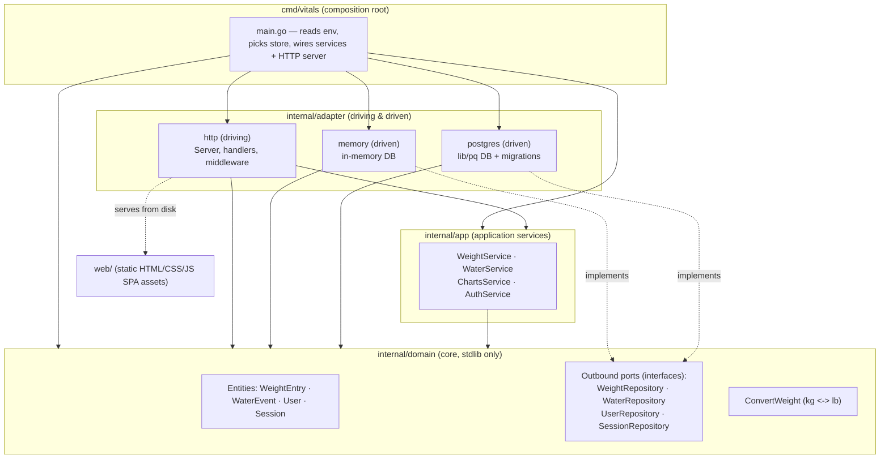

# Vitals Architecture

## Purpose & context

Vitals is a small, mobile-first Go web app for tracking two daily health
metrics: **body weight** (kg or lb) and **water intake** (liters). Users log a
value, the app stores an append-only event stream per metric, and the UI
surfaces today's total/latest reading, a recent-entries list, and a per-day
trend chart. Authentication is per-user (cookie session, first-run setup user,
optional OIDC/Authelia SSO), and each metric row is scoped by `UserID`.

The backend is a single Go binary (`cmd/vitals`) that serves a JSON API under
`/api/*` and a vanilla-JS frontend from `web/`. Storage is pluggable: an
in-memory store for dev/ephemeral use (the default) and PostgreSQL for
production. The project is organized as a **hexagonal (ports & adapters)**
codebase and is deployed as a container in the homelab cluster.

## Component & dependency diagram

Dependencies point **inward** — outer rings may depend on inner rings, never the
reverse.



## Key request flow (end to end)

Example: **`PUT /api/weight/today`** (record today's weight), naming the real
functions.

1. `cmd/vitals/main.go:main` builds the store (`memory.New()` or
   `postgres.Open`), constructs services with `app.NewWeightService` /
   `NewWaterService` / `NewChartsService` / `NewAuthService`, then
   `adapthttp.New(...)` and serves `srv.Handler()` via `http.ListenAndServe`.
2. `Server.Handler()` (`internal/adapter/http/server.go`) builds two muxes: a
   root mux and an `/api`-stripped `api` mux. The whole tree is wrapped in
   `loggingMiddleware(withNoCache(root))`.
3. The request hits `api` route `/weight/today`, which is registered as
   `s.authMiddleware(http.HandlerFunc(s.handleWeightToday))`.
4. `Server.authMiddleware` (`middleware.go`) authenticates: it honors an
   Authelia `Remote-User` header via `AuthService.ValidateForwardAuth`, else
   falls back to the `session` cookie via `AuthService.ValidateSession`. On
   success it puts `*domain.User` into the request context
   (`userContextKey`); otherwise it returns `401`.
5. `Server.handleWeightToday` (`handlers_weight.go`) reads the user with
   `userFromContext`, and for `PUT` decodes the body with `parseJSON`, then calls
   `s.weight.RecordWeight(ctx, user.ID, value, unit)`.
6. `app.WeightService.RecordWeight` (`weight_service.go`) validates
   (`value > 0`, `unit in {kg,lb}`), computes the local day, and calls the
   outbound port: `repo.AddWeightEvent(...)` then
   `repo.LatestWeightForLocalDay(...)`.
7. The port is satisfied by the store selected at startup —
   `memory.DB.AddWeightEvent` or `postgres.DB.AddWeightEvent` — which performs
   the actual write.
8. The handler serializes the result with `writeJSON` (`util.go`).

`GET` reads (`/weight/recent`, `/water/today`, `/charts/daily`, …) follow the
same shape: auth middleware → handler → application service → outbound
repository port → store. `ChartsService.GetDaily` additionally fans out over a
day range and normalizes units with `domain.ConvertWeight`.

## Ports & adapters map

This repo is a hexagonal variant with an important, deliberate nuance: **there
is no `internal/ports` package, and there are no inbound (driving) port
interfaces.**

### Inbound (driving) side

The HTTP adapter depends on the application services as **concrete structs**,
not interfaces: `*app.WeightService`, `*app.WaterService`, `*app.ChartsService`,
`*app.AuthService` (see `Server` fields in `server.go` and the `adapthttp.New`
signature). The "inbound port" is therefore the exported method set of those
services in `internal/app`, with no interface abstraction between adapter and
application. This is fine for a single driving adapter; it is a known,
intentional simplification rather than the textbook "inbound port interface".

### Outbound (driven) side

The outbound port interfaces are Go interfaces declared in **`internal/domain`**
(not `internal/app`). Each is implemented by both storage adapters:

| Outbound port (interface) | Declared in | Implemented by |
|---|---|---|
| `domain.WeightRepository` | `internal/domain/weight.go` | `memory.DB`, `postgres.DB` |
| `domain.WaterRepository` | `internal/domain/water.go` | `memory.DB`, `postgres.DB` |
| `domain.UserRepository` | `internal/domain/auth.go` | `memory.DB`, `postgres.DB` |
| `domain.SessionRepository` | `internal/domain/auth.go` | `memory.SessionRepo`, `postgres.SessionRepo` |

The application services consume these interfaces:
`WeightService`→`WeightRepository`, `WaterService`→`WaterRepository`,
`ChartsService`→`WeightRepository`+`WaterRepository`,
`AuthService`→`UserRepository`+`SessionRepository`. `cmd/vitals/main.go` is the
composition root that binds a concrete store to each interface variable.

> Deviation note: the classic ports-and-adapters formulation puts the outbound
> port interfaces in the application layer (the app "owns" its ports). Vitals
> instead co-locates the repository interfaces with the entities in
> `internal/domain`. This is a valid and internally consistent choice (the
> interfaces reference only domain entities and stdlib types), and it is the
> convention the codebase and `AGENTS.md` already document. The boundary guard
> below is scoped to this reality.

### `internal/testdoubles`

`internal/testdoubles` is a placeholder for outbound-port fakes used by unit
tests (`ServerDeps`). It currently holds no internal imports; the guard allows
it to depend on `domain` and `app` for when fakes are added.

## The inward dependency rule (explicit)

- **`internal/domain`** imports only the Go standard library. No DB drivers, no
  HTTP libraries, no third-party packages. It defines the entities and the
  outbound repository port interfaces.
- **`internal/app`** depends on `internal/domain` (plus stdlib and vendored
  crypto such as `golang.org/x/crypto/bcrypt`). It holds the application
  services and all business validation. It consumes the outbound ports; in this
  repo those ports live in `domain`.
- **`internal/adapter/*`** depends on `internal/app` and/or `internal/domain`.
  Adapters never import each other. The driving adapter (`http`) calls
  application services; the driven adapters (`memory`, `postgres`) implement the
  domain repository interfaces.
- **`cmd/vitals`** is the composition root and may depend on everything; it is
  the only place concrete adapters and services are wired together.

This rule is mechanically enforced by go-arch-lint — see
[Boundary guard](#boundary-guard-go-arch-lint) below.

## External integrations & key design decisions

- **PostgreSQL** via `github.com/lib/pq` (`internal/adapter/postgres`).
  `postgres.Open` sets pool limits, pings, and runs `migrate` on startup.
  `POSTGRES_URL` selects Postgres; `POSTGRES_USER`/`POSTGRES_PASSWORD` map to
  `PGUSER`/`PGPASSWORD`.
- **HTTP routing** uses the stdlib `net/http` `ServeMux` only — no third-party
  router. Middleware (`authMiddleware`, `requireAuthHTML`, `loggingMiddleware`,
  `withNoCache`) are plain `http.Handler` decorators.
- **Auth**: bcrypt password hashing (`golang.org/x/crypto/bcrypt`), random
  session tokens, cookie sessions, an initial-setup user, Authelia forward-auth
  header support, and optional OIDC SSO via `github.com/coreos/go-oidc/v3` +
  `golang.org/x/oauth2` (enabled when `SSO_ISSUER_URL` is set).
- **Web assets** in `web/` are static HTML/CSS/vanilla-JS served from disk by
  `spaFromDisk` (`WEB_DIR`, default `web`); `/login` and `/signup` are public,
  everything else is gated by `requireAuthHTML`. There is no server-side
  templating or JS build step.
- **Storage is pluggable behind interfaces** so the same services run against
  in-memory (default) or Postgres with no code change — the swap happens in
  `main.go`.
- **Append-only event model**: weight and water are stored as events;
  "today's value" and totals are derived (latest-for-day / sum-for-day), and
  "undo last" deletes the most recent event.

## Deployment

- Built as a multi-arch (`linux/amd64,linux/arm64`) container from the root
  `Dockerfile` (distroless-ish `alpine`, runs as UID `65534`, `WEB_DIR=/web`,
  exposes `8080`).
- Published image: **`ghcr.io/gjcourt/vitals`**. CI builds and pushes it via
  `.github/workflows/image.yml` on every push to `master` (authenticating with
  the built-in `GITHUB_TOKEN`), publishing three tags: `YYYY-MM-DD` (mutable),
  `YYYY-MM-DD-<sha7>` (immutable — the tag to pin), and `latest`. A manual
  fallback exists in `scripts/build_and_push_image.sh`.
- The app runs in the homelab Kubernetes cluster. The **image-tag pin is not in
  this repo** — it lives in the homelab manifests repo, at
  `homelab/apps/base/vitals/deployment.yaml`. Bumping the running version means
  reading the published `YYYY-MM-DD-<sha7>` tag from the `image.yml` run and
  pinning it there (see `AGENTS.md`).

## Boundary guard (go-arch-lint)

The inward dependency rule is enforced in CI by
[`go-arch-lint`](https://github.com/fe3dback/go-arch-lint) using
`.go-arch-lint.yml` at the repo root (config `version: 3`). Components map to the
real layout — `domain`, `app`, `adapter` (singular, globs all sub-adapters),
`cmd`, `testdoubles` — and `deps` encodes:

| Component | May depend on (internal) |
|---|---|
| `domain` | *(nothing internal — stdlib only)* |
| `app` | `domain` |
| `adapter` | `domain`, `app` |
| `testdoubles` | `domain`, `app` |
| `cmd` | `domain`, `app`, `adapter`, `testdoubles` |

External/vendored packages are allowed everywhere via
`allow.depOnAnyVendor: true`. Run locally with:

```bash
go install github.com/fe3dback/go-arch-lint@v1.18.0
go-arch-lint check
```

At the time this doc was written the check is **green** with no boundary
violations: `domain` imports only stdlib, `app` imports only `domain`, adapters
import only `app`/`domain` and never each other, and `cmd` is the sole wiring
point.
